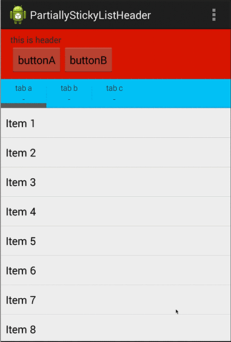

# PartiallyStickyListHeader

ListView with partially sticky header.

Basically, header is consisted of two views: List header and sticky view.

ListView and sticky view must be placed in a same FrameLayout.

# How it work
check the [code](./app/src/main/java/fragment/MainListFragment.java).
